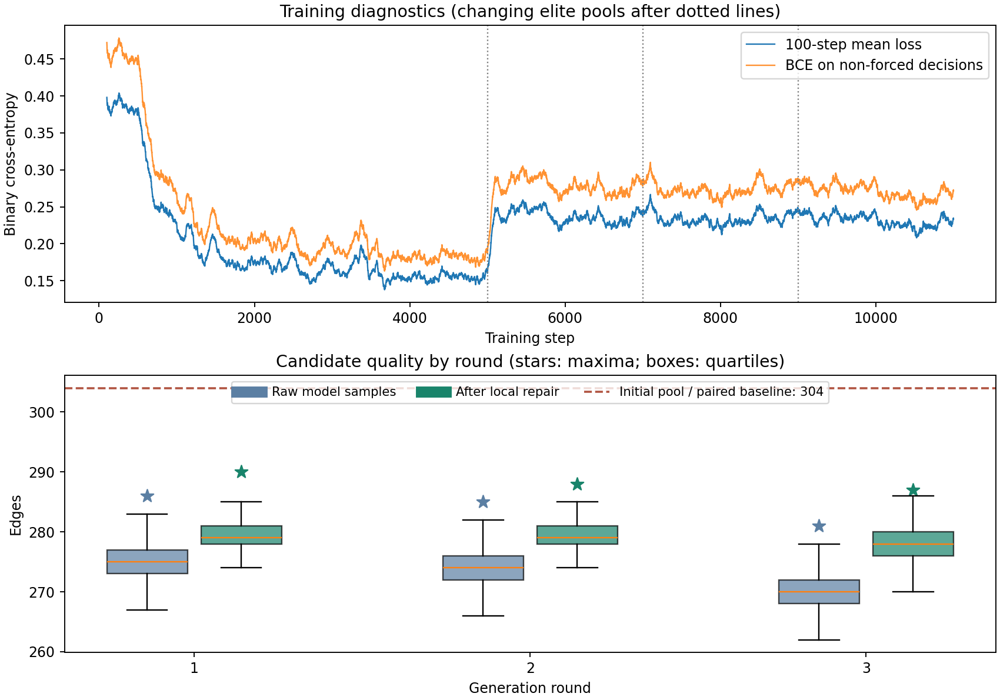

# 首次 180 轨道语料单卡试验：结果与复核

核查日期：2026-09-12。作业 **21925840** 已正常完成，全部结果通过 Horizon 从实验室回传至 [GitHub 结果分支](https://github.com/wssswsws/erdos-86/tree/results/corpus-21925840)，并取回本地。原始文件位于 [pilot-seed-8601](../artifacts/experiments/slurm-21925840/pilot-seed-8601/)，统计和复核在 [analysis.json](../artifacts/experiments/slurm-21925840/analysis/analysis.json)。

**本次没有找到 305 边构造。模型原始生成最多 286 边，局部修复后最多 290 边；最终保存的 304 边最好图来自原有训练集。初始训练的 loss 明显下降，但未转化为接近或超过已知构造的搜索表现。**

## 运行与来源

- Slurm：`COMPLETED`，退出码 `0:0`，总用时 **19 分 39 秒**，分配单张 A100 80GB PCIe、4 CPU、16 GB 内存；GPU 占用约 **0.3275 小时**。程序记录为 1173.19 秒，差异来自启动和收尾。
- 运行代码：`46dd29801eef68c54151241805462fe4eb83977e`；源码工作区为 `clean`，8 个 Python 源文件哈希与本地一致。
- 初始训练集：180 个经审核的 304 边对称轨道代表，种子 8601；数据与审核文件哈希均与报告一致。
- 完成 **11,000 个训练步骤、3 轮生成，每轮 4,096 张，共 12,288 张**。停止原因为 `completed`，不是超时。
- PyTorch 峰值已分配张量显存为 543,417,856 字节，约 0.506 GiB；不代表进程的全部 GPU 内存。
- 云端原始候选 `candidates.jsonl` 与约 16 MB 的 `checkpoint.pt` 均保留。GitHub 回传的是完整候选的无损压缩文件 `candidates.jsonl.gz`，不含模型权重。

## 生成质量

| 生成轮次 | 原始生成平均边数 | 原始生成最高 | 修复后平均边数 | 修复后最高 | 配对传统搜索 |
| --- | ---: | ---: | ---: | ---: | ---: |
| 1 | 275.29 | 286 | 279.35 | **290** | 全部 304 |
| 2 | 274.28 | 285 | 279.39 | 288 | 全部 304 |
| 3 | 270.04 | 281 | 278.09 | 287 | 全部 304 |

配对传统搜索从初始 304 边代表出发，执行相同次数的局部扰动；模型从空前缀逐边生成后再修复。两者起点不同，而且没有匹配神经网络训练在内的总算力，因此不能把这个对照当作严格的同预算方法排名。但它清楚地说明：**这次模型提供的新起点没有改善现成的 304 边起点，后两轮也没有出现质量进步。**

所有修复后候选都低于 304，既没有追平也没有超过配对基线。新的模型候选中最好的一张已单独保存为 [best-model-repaired.json](../artifacts/experiments/slurm-21925840/analysis/best-model-repaired.json)，供后续检查；它不是新的 Q7 最佳构造。

## 完整 loss 曲线说明了什么

日志每 100 步打印的是当步 batch 的 loss；本次从报告中读取全部 11,000 步，计算滑动平均，并按非强制位置的数量归一化。

| 初始训练阶段 | 原始平均 loss | 非强制位置平均 BCE | 非强制位置比例 |
| --- | ---: | ---: | ---: |
| 步骤 1–500 | 0.3883 | 0.4585 | 84.68% |
| 步骤 4501–5000 | 0.1550 | 0.1816 | 85.38% |

在训练池不变的初始 5,000 步中，损失明显下降；归一化后也下降，所以不能用“强制为零的位置增加了”解释这段下降。这说明模型拟合训练分布的能力提高了。它仍不是固定留出集上的评价，也不证明对未见轨道的泛化或生成质量提高。

第一轮候选加入训练池后，loss 上升到约 0.23–0.24，随后基本停留在那里。下面的虚线分别标出重新构建训练池的位置；不能把虚线前后的 loss 当成同一数据分布下的直接比较。



## 训练池中的具体问题

现有代码把旧训练池和新候选合并后，取边数最高的 512 张图。初始只有 180 张 304 边图，因此第一轮更新后得到：

- 180 张原有 304 边图；
- 332 张新生成并修复的 283–290 边图。

因为训练仍均匀抽样，304 边图的期望训练占比从 100% 降为 **180/512 = 35.16%**，其余 **64.84%** 是较低边数图。后两轮仍只有 180 张 304 边图，较低边数样本最低为 284。三个更新后的精英池平均边数依次为 291.11、291.57、291.62。

这些较低质量图可能提供不同结构，但它们同时改变了模型模仿的目标。训练池变化与 loss 跃升、后续原始生成边数下降同时出现，**提示应优先检查精英池采样策略；尚无受控实验能确定这是退化的唯一或主要原因。**

另一个待检验的因素是：训练时模型接收已知构造的正确前缀，生成时接收自己的选择；448 次连续选择可能积累偏差。当前没有固定前缀评测或采样前缀诊断，不能据此直接断言原因。

## 用时与验证范围

| 阶段 | 实测用时 |
| --- | ---: |
| 训练 | 358.43 秒，约 5.97 分钟 |
| 自回归生成 | 583.17 秒，约 9.72 分钟 |
| 模型候选局部修复 | 92.58 秒 |
| 配对传统局部搜索 | 88.41 秒 |
| 程序内其他开销 | 约 50.60 秒 |

本地读取全部保存的修复后边表，重新检查超立方体边合法性、重复边、所有方形及公共邻居，**12,288 张全部通过**，且精确标号各不相同。最终 `best.json` 也通过，并确认它属于初始训练集。所有候选分轮计数与报告吻合；使用相同的精英筛选规则重建了每轮训练池。

原始生成图和配对基线的完整边表没有保存，只有当时的验证结果或边数，因此它们的统计可以交叉核对，但不能在本地重新验证每张原始图或基线图。没有对新候选进行轨道去重，12,288 个不同标号不等于 12,288 个不同轨道。

错误日志有三次 PyTorch“未安装 NumPy”的警告。作业正常完成，现有运行路径不依赖 NumPy 转换；这不是本次训练失败证据，但后续若加入 NumPy 分析或规范化检查，需要补齐环境。

## Iteris 记录与后续边界

本次单卡试验任务标为 `done`，表示约定的实验和报告审核已完成，不表示 305 的研究目标已完成。计算结论记录为 `reviewed`，不是 Lean 形式化证明，也没有运行 Iteris 代理审核面板。

下一步应先补齐固定评测和百步平均日志，并设计训练池对照：保持 304 边参考池的训练权重，明确较低边数候选的用途，再用相同种子和预算比较。也应保存必要的原始/基线边表，以便完整复核。这些是待办建议；本次没有修改训练算法、续训或提交新 GPU 作业。

复核命令：

```bash
MPLCONFIGDIR=/tmp/erdos86-mpl python3 scripts/analyze_graphgps_pilot.py \
  --run artifacts/experiments/slurm-21925840/pilot-seed-8601 \
  --output artifacts/experiments/slurm-21925840/analysis --plot
```
