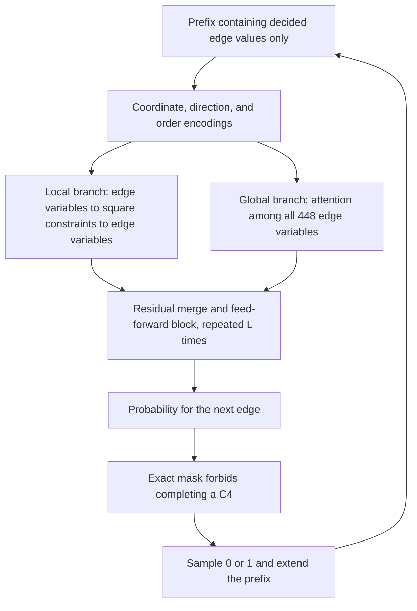

# Route 4: a constraint-graph GraphGPS-style generator

Latest status, September 13, 2026: all six runs of Slurm **21929229** completed on one A100 in **2:04:42**. The best repaired model candidate has **294 edges** and was independently checked locally. No model sample reached 300, 304, or 305. The final mean slightly favors protected reference sampling, but the experiment has not established competitive search performance. See the [final results](graphgps-diagnostic-suite-results.md). Full archive review is pending; further training is paused.

The earlier [corpus pilot](corpus-pilot-21925840-results.md) completed 11,000 training steps and 12,288 repaired samples in 19 min 39 sec. Raw generation reached 286 edges and repair reached 290. Its overall 304-edge best was an existing training reference.

## Architecture

Each Q7 candidate edge is a variable node; each square is a constraint node:

- 448 variable nodes with states undecided, excluded, or selected.
- 672 square nodes, each incident to four variables.
- Each variable belongs to six squares: 2,688 incidences in total.
- Each square imposes a sum of at most three selected variables.



This independently written **GraphGPS-style** implementation has local message passing, positional/structural encodings, and global attention. The local branch uses mean aggregation and MLPs; global variable attention uses PyTorch SDPA. It does not depend on PyTorch Geometric or reproduce an official GraphGPS experiment.

Architectural references: [GraphGPS paper](https://arxiv.org/abs/2205.12454) and [official code](https://github.com/rampasek/GraphGPS). The generation–repair–elite-feedback–retraining loop is motivated by [PatternBoost](https://arxiv.org/html/2411.00566).

Attention is dense over 448 nodes, with an $O(448^2)$ term. Coordinate encodings depend on labeling. Training uses actual cube coordinate permutations and bit flips, but the network is not claimed to be exactly automorphism-equivariant.

## Training and sequential sampling

Training selects a legal target graph, a random edge order, and a prefix length $t$. The model sees only the first $t$ decisions and predicts decision $t+1$. All future labels are hidden before GNN inputs, square features, or attention are built. Tests flip every future label and require the visible prefix and prediction to remain unchanged.

Each training example supervises one position. Uniform prefix sampling estimates the per-position average autoregressive negative log likelihood; a training step is not a complete graph-sequence training pass.

If selecting an undecided edge would close a square whose other three edges are present, the decision is forced to zero and its conditional loss is zero. Otherwise either choice is allowed. Empty and two-edge squares are permitted, and any legal target can pass this mask along its own edge order.

Generating one graph requires **448 full-graph forward passes**. Edge-state changes alter local GNN messages, so the implementation has no Transformer-style KV cache. Cost estimates must include all these passes.

## Outer loop and comparison boundaries

1. Load and verify the reference population.
2. Train on randomly sampled prefixes.
3. Generate candidates sequentially and independently check legality.
4. Improve them with bounded delete-and-refill local search.
5. Recheck candidates and update the training population under the selected feedback policy.
6. Save model, optimizer, random states, population, and complete candidate edge lists.

The original pilot paired candidates with classical search using the same number of repair kicks. The diagnostic suite adds both reference-start and empty-start baselines. These match local-search settings, not total compute including training. A separate CPU `baseline` command supports explicitly budgeted comparisons.

Local repair was written separately from upstream search scripts with known counting issues. Acceptance uses square enumeration and common-neighbor checks in an independent module. The original baseline verifier is unchanged.

## Code

| File | Responsibility |
| --- | --- |
| [cube.py](../erdos86_gps/cube.py) | Variable–constraint incidence and cube automorphisms |
| [model.py](../erdos86_gps/model.py) | Local GNN, global attention, prefixes, and action mask |
| [engine.py](../erdos86_gps/engine.py) | Training, sequential sampling, and checkpoints |
| [search.py](../erdos86_gps/search.py) | Bounded local repair and startup population |
| [verify.py](../erdos86_gps/verify.py) | Independent standard-library candidate verification |
| [cli.py](../erdos86_gps/cli.py) | Smoke, calibration, experiment loop, estimates, and verification |
| [tests](../tests/graphgps/test_generator.py) | Leakage, legality, gradients, restoration, and budget checks |

The `local` and `global_attention` settings can disable either branch for ablations. Both are enabled by default. The existing runs do not establish a separate benefit for either branch.

## Initial CPU smoke evidence

The initial environment was Python 3.13.7, PyTorch 2.10.0, macOS arm64, and two CPU threads. This historical smoke did not use CUDA or MPS.

It used the full Q7 incidence structure with a width-32, two-layer, four-head model containing 43,073 parameters. Eight initial training steps, two generated graphs, repair and feedback, and four further training steps completed. Both branches received nonzero gradients; checkpoint loading passed, and tests checked that a restored next optimizer step matched uninterrupted training.

Raw edge counts were 236 and 233; repaired counts were 262 and 263. All passed dual verification. The best remained the existing 304-edge seed. Fifteen initial tests passed, including a full-size width-128, four-layer, eight-head forward/backward check. These results demonstrated functionality, not a learning advantage.

Evidence: [report.json](../artifacts/experiments/graphgps-smoke/report.json) and [tests.xml](../artifacts/experiments/graphgps-smoke/tests.xml). Earlier development output is preserved in `initial-implementation/`. Reports bind source-file hashes. Later diagnostic preparation increased coverage to 21 tests and a two-arm CPU smoke.

## Budgets: estimates versus measurements

The initial [pilot configuration](../configs/graphgps/pilot.json) has width 128, four layers, eight heads, **1,324,033 parameters**, and training/sampling batches of 32.

| Item | Initial pilot |
| --- | ---: |
| Initial training | 5,000 steps |
| Outer rounds | 3 |
| Generated graphs per round | 4,096 |
| Training after each feedback round | 2,000 steps |
| Total training | 11,000 steps |
| Total generated graphs | 12,288 |
| Sampling batches | 384 |
| Batched full-graph forward passes during sampling | 172,032 |

The initial rough matrix-multiplication estimate was 1.70 GFLOPs per single-graph prefix and 11.17 PFLOPs for training plus generation. It omitted aggregation, normalization, masking, and Python overhead. Dividing by advertised peak GPU FLOPs would not give a reliable runtime.

Before GPU access, the project reserved 2–4 GPU hours. The assumptions ranged from 15–80 ms per training step, 5–25 ms per batched sampling position, and 20–200 ms per CPU repair. Estimated training plus sampling was 0.28–1.44 hours, or 0.42–2.80 allocated GPU hours including serial repair and a paired baseline. These were planning assumptions, not measured GPU performance.

The [A100 calibration](a100-calibration-21924947.md) subsequently predicted 0.316 hours for the original pilot; the complete [corpus pilot](corpus-pilot-21925840-results.md) used **0.3275 GPU hours**. The larger six-run diagnostic suite used **2.0783 GPU hours**. None is a time estimate for finding 305.

GPU allocation time includes CPU work performed while the GPU remains reserved. Soft limits are checked between operations and may leave planned rounds incomplete; final saving adds overhead. The historical estimator output remains in [gpu-budget.json](../artifacts/experiments/graphgps-smoke/gpu-budget.json).

## Reproduction on an external GPU

Prepare an isolated environment with the tested PyTorch 2.10.0 build appropriate for the host driver, then install [requirements-graphgps.txt](../requirements-graphgps.txt). PyG and Iteris are not required to run the computation.

```bash
python -m pytest -q tests/graphgps
python -m erdos86_gps benchmark --device cuda --steps 20 \
  --output artifacts/experiments/my-gpu-calibration.json
python -m erdos86_gps estimate \
  --calibration artifacts/experiments/my-gpu-calibration.json \
  --output artifacts/experiments/my-gpu-estimate.json
```

Calibration measures training, complete 448-step sampling, CPU repair, and peak allocated CUDA memory. The estimator rejects CPU calibration for GPU-hour estimates and mismatched model, batch, or repair settings. CUDA uses bf16 autocast when supported, otherwise fp32.

For an explicitly authorized new pilot using the audited corpus:

```bash
python -m erdos86_gps run --execute --device cuda \
  --population references/corpora/q7-304-orbits/representatives.jsonl \
  --population-audit references/corpora/q7-304-orbits/audit.json \
  --output artifacts/experiments/my-gpu-pilot
```

`run` rejects ordinary CPU execution or a missing `--execute`, and refuses to overwrite existing experiment output. Architecture-incompatible checkpoints are rejected. With `--checkpoint PATH`, a new invocation restores state but repeats the configured round budget; use a smaller continuation configuration and a fresh directory when appropriate.

A custom population uses JSONL records such as `{"n":7,"edges":[[0,1],...]}`. Import checks legality, hashes, and exact-label duplicates; it does not perform a new orbit census or automatically create a holdout. The audited corpus and diagnostic split are described in their dedicated notes.

```bash
python -m erdos86_gps baseline --wall-seconds 600 \
  --output artifacts/experiments/my-cpu-baseline.json
python -m erdos86_gps verify \
  --candidate artifacts/experiments/my-gpu-pilot/best.json
```

The 600-second baseline budget is an example. Set comparison budgets and metrics before a real experiment. If a classical baseline finds 305, its provenance remains classical rather than model-generated.

Use the [Slurm guide](slurm-guide.md) for the tested lab workflow and the [diagnostic plan](graphgps-pilot-diagnostic-plan.md) for the six-run design. The current pause remains in force; these commands are reproduction instructions, not an automatic restart.
