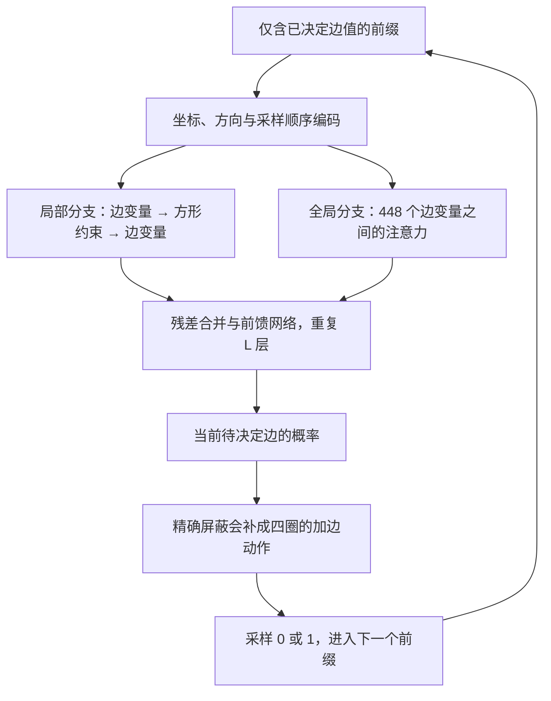

# 路线 4：约束图 GraphGPS 风格生成器

日期：2026-09-12。初始实现、CPU smoke、A100 校准与首次 180 轨道语料单卡试验均已完成。作业 21925840 的回传与独立复核见[完整结果与诊断](corpus-pilot-21925840-results.md)，提交配置见[单卡试验](corpus-single-gpu-pilot.md)。以下初始实现细节与历史 smoke 记录保留供追溯。

**当前结论：完整流程能够运行，但本次模型原始生成最高 286 边，局部修复后最高 290 边，未改善初始训练集的 304 边，也没有得到 305。** 单 A100 80GB 实测 19 分 39 秒、11,000 训练步、12,288 张修复后候选，全部保存的候选均经本地独立整数复核。初始 loss 下降；精英回填使 304 边样本的训练占比从 100% 降为约 35%，后续需受控诊断。试验任务已完成，后续诊断待办保持暂停，未提交新 GPU 作业。

## 已实现的架构

把 Q7 的每条候选边视为一个变量节点，把每个方形视为一个约束节点：

- 448 个变量节点，状态为“未决定 / 不保留 / 保留”。
- 672 个方形节点，每个连接 4 个变量；每个变量连接 6 个方形，共 2,688 条关联。
- 每个方形约束为所连接变量之和至多 3。



这是一份独立编写的 **GraphGPS 风格**实现，使用局部消息传递、位置/结构编码、全局注意力三个部件，并非官方 GraphGPS 仓库某个实验的复现。局部消息采用均值聚合和 MLP；变量全局注意力使用 PyTorch SDPA。代码不依赖 PyTorch Geometric。

思想来源：[GraphGPS 论文](https://arxiv.org/abs/2205.12454)、[官方实现](https://github.com/rampasek/GraphGPS)。生成—修补—精英回填—再训练的外层循环来自 [PatternBoost](https://arxiv.org/html/2411.00566)。

此实现采用 448 节点的稠密注意力，复杂度含 $O(448^2)$ 项，没有使用线性注意力。坐标位置编码会依赖顶点标号；训练采用真正的立方体坐标置换和位翻转增强，但不声称网络具有精确的自同构等变性。

## 训练与采样怎样保持一致

训练时随机选择一张合法图、一个边顺序和一个前缀长度 $t$。仅将前 $t$ 个已经决定的边值交给模型，预测第 $t+1$ 条边。

未决定的边值在进入 GNN、方形特征和全局注意力之前就全部隐藏。这样可以使用前缀状态上的全局注意力，不会经由方形节点泄漏未来标签。测试会任意翻转所有未来标签，检查前缀输入及预测保持相同。

每步只训练一个位置。对均匀随机前缀采样，它估计的是完整自回归负对数似然的每位置平均值；训练步数不能当作完整图序列的训练次数。

若某条未决定边已与三条保留边组成同一个方形，则该动作被强制为 0，条件损失也为 0。否则两种动作都允许。这个屏蔽没有限制为 odd-square 类，空方形和两边方形均可出现；合法目标图总能沿其自身的边决定顺序通过屏蔽。

完整生成必须进行 **448 次全图前向**。由于边状态改变后 GNN 的消息也改变，目前没有实现 Transformer 式 KV cache，不能按“一张图一次前向”估算成本。

## 外层搜索循环

1. 从已验证的 304 边种子和有固定随机种子的贪心/修补结果建立初始池。
2. 随机前缀训练模型。
3. 逐边生成候选，先做独立无四圈检查。
4. 用删除若干边再合法补边的局部搜索改善候选。
5. 再次独立验图，将较好的候选回填精英池，继续训练。
6. 保存模型、优化器、训练 RNG、增强 RNG、精英池和完整边表。

每批候选另运行相同次数修补的经典对照。这只是**相同修补次数**的诊断，不是相同总计算成本的性能比较。另提供纯 CPU `baseline` 命令，可在 GPU 实验结束后按记录的总成本/时间安排对照。学习是否有效仍须在预先确定的评价标准、多随机种子和明确成本口径下比较。

局部修补采用新写的有限次删边/补边操作，没有导入已有仓库中存在已知计数缺陷的搜索器。最终验收由独立模块同时检查全部方形和公共邻居对；原有 `references/baselines/86-verify.py` 未修改。

## 代码入口

| 文件 | 职责 |
| --- | --- |
| [cube.py](../erdos86_gps/cube.py) | 变量—约束关联与真实立方体自同构 |
| [model.py](../erdos86_gps/model.py) | 局部 GNN、全局注意力、前缀构造与动作屏蔽 |
| [engine.py](../erdos86_gps/engine.py) | 随机前缀训练、逐边采样、检查点 |
| [search.py](../erdos86_gps/search.py) | 有界局部修补及启动数据 |
| [verify.py](../erdos86_gps/verify.py) | 标准库独立候选验证器 |
| [cli.py](../erdos86_gps/cli.py) | smoke、GPU 校准、完整循环、预算、对照、验图 |
| [测试](../tests/graphgps/test_generator.py) | 泄漏、合法性、梯度、恢复、超时与预算检查 |

通过配置中的 `local`、`global_attention` 可以分别关闭分支以做消融；默认两者均开启。此次 smoke 使用默认组合，尚未执行消融实验。

## 本次 smoke 的证据

环境：Python 3.13.7、PyTorch 2.10.0、macOS arm64、CPU 2 线程。没有可用 CUDA 或 MPS；未启动外部 GPU。

- Q7 的完整 448 变量 / 672 约束规模。
- smoke 模型：32 宽、2 层、4 头、43,073 参数。
- 8 步初始训练、生成 2 张图、局部修补、精英回填、再训练 4 步。
- 两个分支都获得非零梯度；检查点保存、读取通过。单元测试进一步核对恢复后的下一步优化与连续训练完全一致。
- 原始候选边数为 236、233；修补后为 262、263，均通过双重验证。
- 最好结果仍为原有 304 边种子；这些数字不支持任何学习优势或数学新颖性结论。
- 15 项测试通过，包含正式模型宽度 128、4 层、8 头的 Q7 前向/反向检查；正式 batch=32 的 CUDA 路径尚未验证。

原始报告：[report.json](../artifacts/experiments/graphgps-smoke/report.json)。测试记录：[tests.xml](../artifacts/experiments/graphgps-smoke/tests.xml)。最早一轮开发 smoke 保留在同目录 `initial-implementation/`，当前报告对应最终代码；各报告保存源文件哈希。

## GPU 小时预算

正式首轮配置在 [pilot.json](../configs/graphgps/pilot.json)：128 宽、4 层、8 头，**1,324,033 参数**，训练 batch=32、生成 batch=32。

| 项目 | 计划规模 |
| --- | ---: |
| 初始训练 | 5,000 步 |
| 外层轮次 | 3 |
| 每轮生成 | 4,096 张图 |
| 每轮回填后训练 | 2,000 步 |
| 总训练步数 | 11,000 |
| 总生成图数 | 12,288 |
| 生成批次数 | 384 |
| 生成阶段批量全图前向次数 | 172,032 |

单次单图前缀约 1.70 GFLOPs 的矩阵乘法，全部训练与采样约 11.17 PFLOPs；这是粗略算量，不包含聚合、归一化、屏蔽与 Python 开销，不能直接除以显卡广告峰值当作实际时间。

**初步建议单卡预留 2–4 GPU 小时。** 这是为上述小试验预留的预算，不是解决 305 的时间预测，也不是已测出的 GPU 速度。可先用有 16–24 GB 显存的单卡做校准；所需峰值显存尚未验证，若 batch=32 不合适则调整配置并重新校准。

为了让估算可检查，当前采用以下假设范围：

| 假设 | 较快情景 | 较慢情景 |
| --- | ---: | ---: |
| 一次训练步，batch=32 | 15 ms | 80 ms |
| 一个采样位置，batch=32 | 5 ms | 25 ms |
| 一张图的 CPU 修补 | 20 ms | 200 ms |
| 训练与生成阶段 | 0.28 小时 | 1.44 小时 |
| 加上串行修补和同次数对照，GPU 仍被占用 | 0.42 小时 | 2.80 小时 |

这些是规划用的假设，不对应任何特定 GPU 的实测保证。2–4 小时的预留包含校准、启动和波动余量。本机三个固定图的 16 次 kick 修补实测约 4.9 ms/图，只反映这些 CPU 输入；没有用它推导 GPU 吞吐。

配置有 4 小时运行软时限。程序在训练步、采样位置及候选之间检查时限，到点保存并退出，可能额外花费当前操作和保存时间；时限到达不保证计划轮次已经完成。单卡占用 1 小时记作 1 GPU 小时，CPU 修补期间显卡空闲也可能仍计入租用时长。

估算器：[gpu-budget.json](../artifacts/experiments/graphgps-smoke/gpu-budget.json)。外部 GPU 到位后优先用实际校准替换这些假设。

## 外部 GPU 到位后的执行步骤

在外部机器的项目根目录建立独立 Python 环境。按 [PyTorch 官方安装页面](https://pytorch.org/get-started/locally/)选择适合驱动的 CUDA wheel；本项目固定并测试的版本是 2.10.0，其他版本需要重跑测试。随后安装 [requirements-graphgps.txt](../requirements-graphgps.txt)。不需要安装 PyG，也不需要把 Iteris 本身装进模型环境才能运行计算脚本。

先测试与校准，不直接开启长训练：

```bash
python -m pytest -q tests/graphgps
python -m erdos86_gps benchmark --device cuda --steps 20 \
  --output artifacts/experiments/graphgps-gpu-calibration.json
python -m erdos86_gps estimate \
  --calibration artifacts/experiments/graphgps-gpu-calibration.json \
  --output artifacts/experiments/graphgps-gpu-estimate.json
```

校准会测实际训练步、完整 448 步采样、CPU 修补和 CUDA 峰值已分配显存。估算器会拒绝使用 CPU 校准推导 GPU 小时，也会拒绝与模型、batch 或修补参数不匹配的校准。CUDA 支持 bf16 时使用 autocast，否则保持 fp32。

确认校准结果和预算后，再明确启动 GPU 试验：

```bash
python -m erdos86_gps run --execute --device cuda \
  --output artifacts/experiments/graphgps-gpu-pilot
```

`run` 默认拒绝 CPU 或没有 `--execute` 的调用。它会保留已存在的实验目录，要求为新实验选新目录。不要把 32 宽的 smoke 检查点加载到 128 宽正式模型中；架构不匹配会被拒绝。

若要恢复相同架构的 GPU 检查点，可加 `--checkpoint <path>`。它恢复权重、优化器、训练 RNG 与精英池，但**本次调用会重新执行配置中的轮次预算**，不会声称精确恢复到被打断的逐边采样位置。应为继续运行写较小的配置预算并选择新输出目录。

训练数据可通过 `--population <file.jsonl>` 替换启动池，每行形如 `{"n":7,"edges":[[0,1],...]}`。导入会验图、保存文件哈希并精确去重。它不会自动按自同构轨道去重，也不会创建独立测试集。现有 19,866 图目录的轨道审核任务仍未完成；不得据此报告留出集泛化性能。

纯局部搜索和单份边表的独立检查入口：

```bash
python -m erdos86_gps baseline --wall-seconds 600 \
  --output artifacts/experiments/graphgps-cpu-baseline.json
python -m erdos86_gps verify \
  --candidate artifacts/experiments/graphgps-gpu-pilot/best.json
```

对照的 600 秒只是命令示例，正式比较时需依据 GPU 实验实际总成本和预定评价口径设置。若经典对照发现 305，程序也会记录并停止，但来源标为经典对照，不算模型贡献。

## Iteris 状态与暂停边界

`task-patternboost-q7-design` 和 `task-graphgps-q7-smoke` 完成。`task-graphgps-q7-gpu-pilot` 按用户要求保持 `paused`，等待连接外部 GPU 后校准。

本轮用 Iteris 官方任务/记忆接口保存实现与实验事实，没有另外启动不受限的 `iteris run` 循环。没有新的数学证明认证，没有外部 GPU 作业、后台训练或自动续跑。
